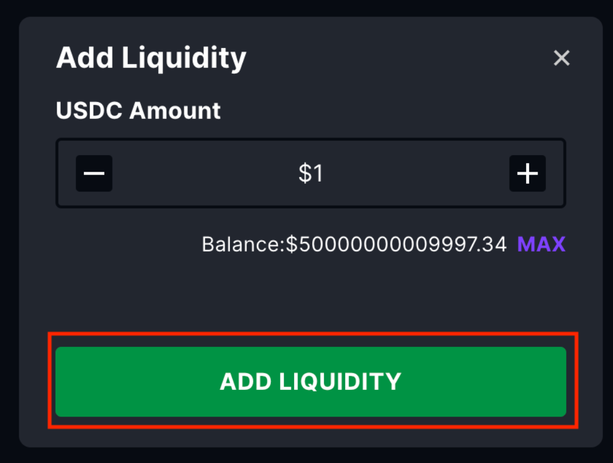
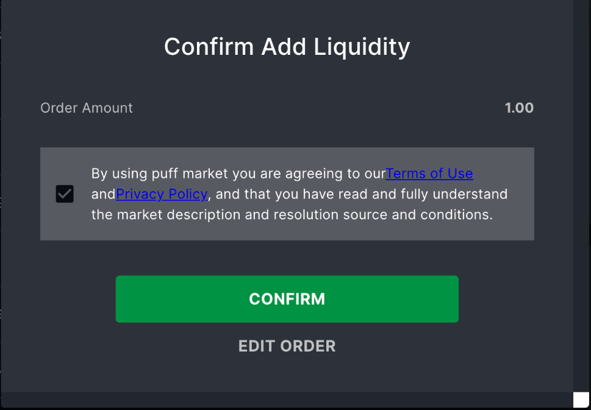
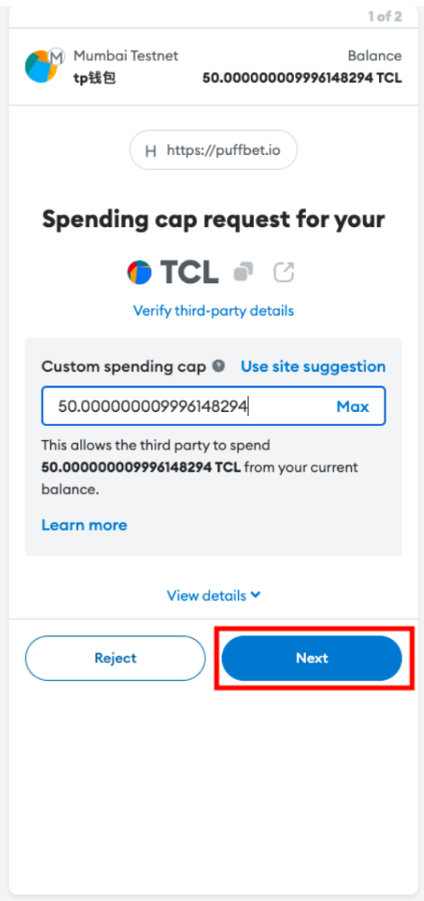
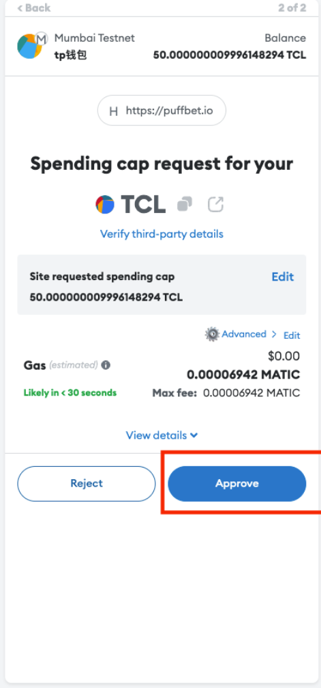
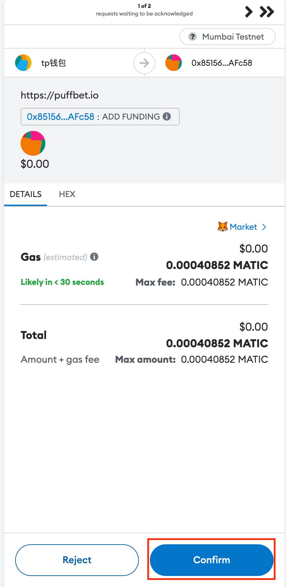

# How to add liquidity to a question

How to add liquidity to a question
1. Navigate to the question interaciton page, and scroll down to the add liquidity module, click it to see more.

2. Once you entered the module, you need to input how much USDC you want to add to this question liquidity pool.

3. The information you submit will aggregate in this confirmation message, if everything is right, press Confirm. Also you can choose Edit Order to make edits.

4. The Metamask will pop up and ask you to finish two transaction sign. The first one is approve your USDC amount to add, which will be default to your order amount, so you do not need to edit, just press next and then approve. The second one will wait like 10 seconds to get another transaction sign, because it has to wait for the first transaction to go through on the blockchain.  All you need to do is to press Confirm. 

Notice: If the market pirce is not 0.5/0.5, you will also receive a portion of Result 1 or Result 2 token in your position details.
