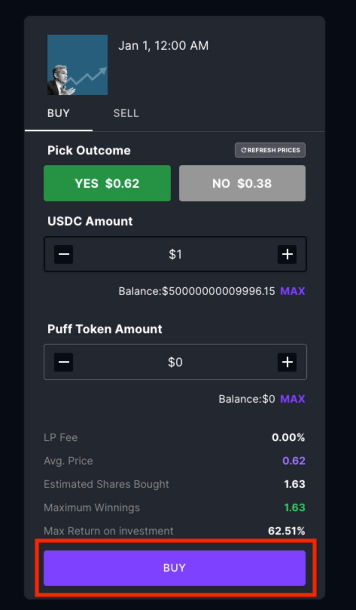
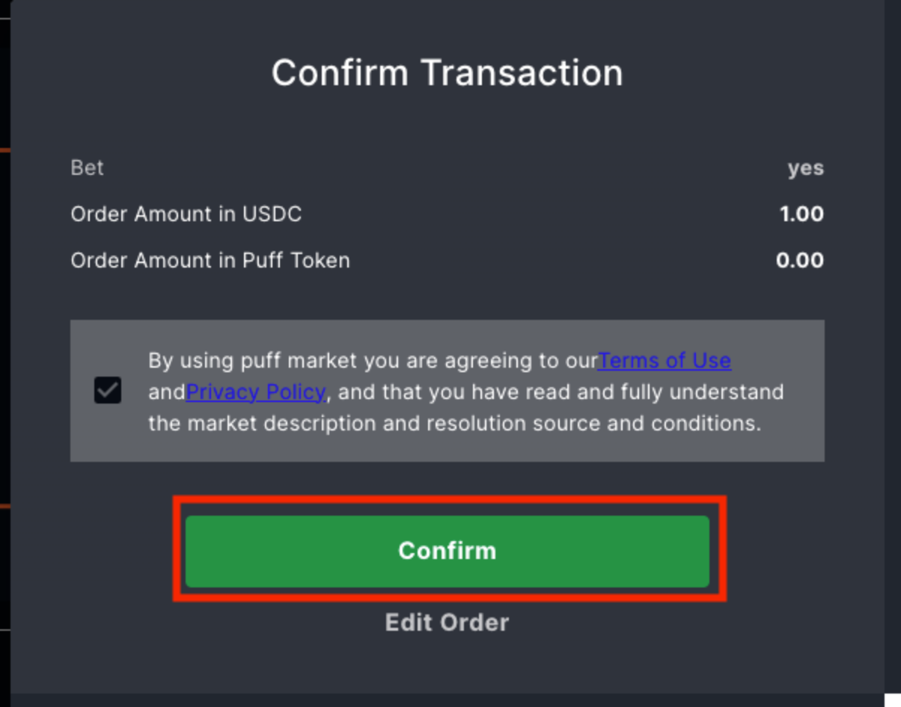
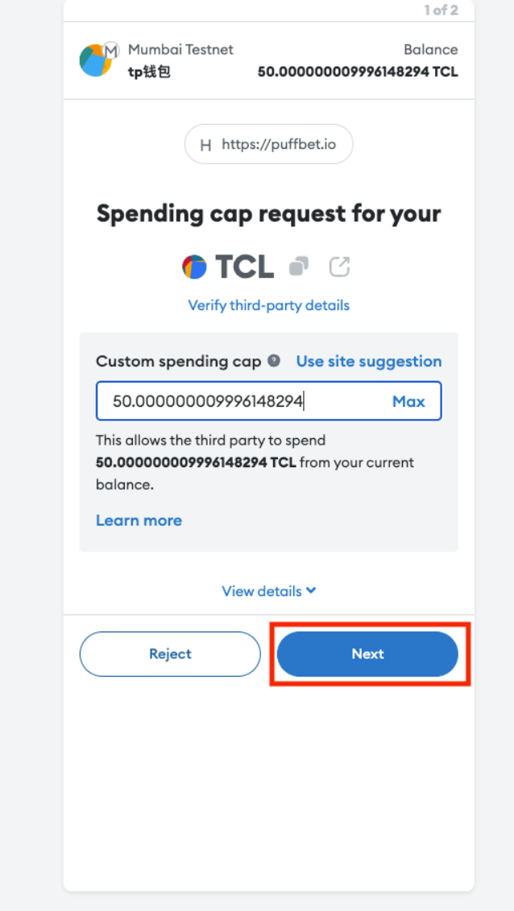
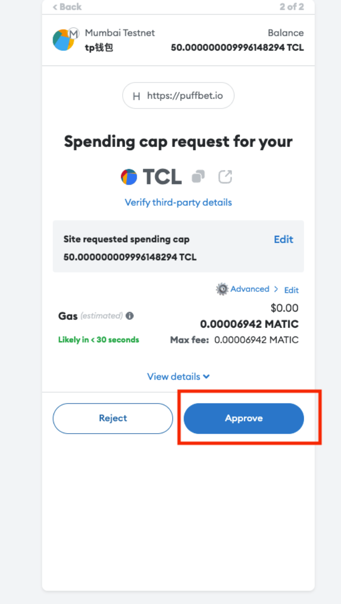
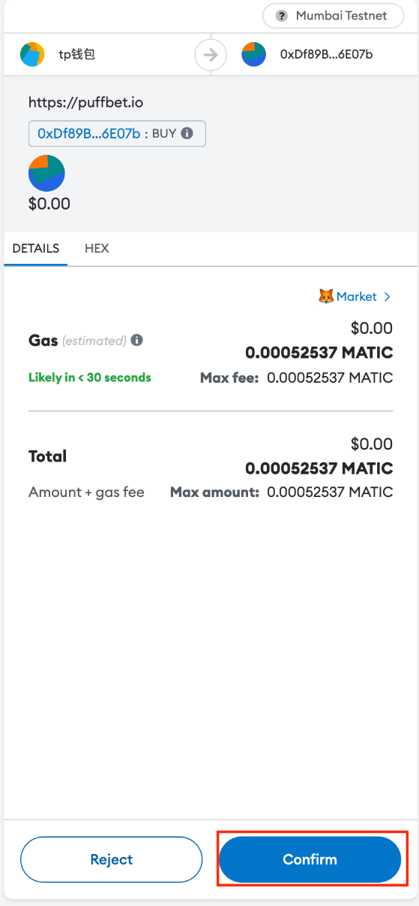
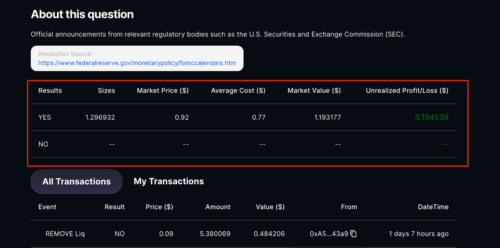

# How to make your first trade

1. Once you navigate to our main page, you can choose your favourite and interested market and then click it.

2. Enter the market, choose the exact question that you want to trade.

3. You are getting into our interaction page, in this page, you can trade, add liquidity, remove liquidity, or redeem for this question, which you entered.

4. The first module is Trade, you can first choose BUY or SELL, and then YES or NO depending on your prediction, and input how much USDC you want to spend to interact. Once you set all the steps, you are ready to press the BUY or SELL button down below.

5. The information you submit will aggregate in this confirmation message, if everything is right, press Confirm. Also you can choose Edit Order to make edits.

6. The Metamask will pop up and ask you to finish two transaction sign. The first one is approve your USDC amount to spend, which will be default to your order amount, so you do not need to edit, just press next and then approve. The second one will wait like 10 seconds to get another transaction sign, because it has to wait for the first transaction to go through on the blockchain.  All you need to do is to press Confirm. Congratulations on your first Trade!

7. You can then check your position details for this question in this area.

