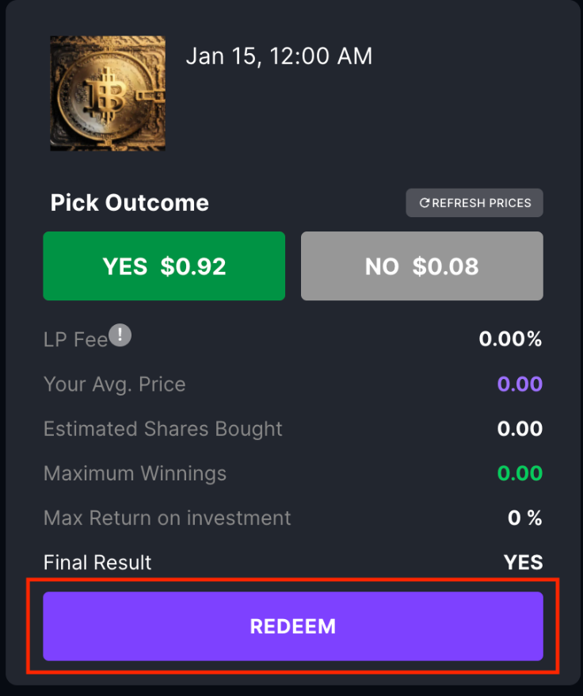
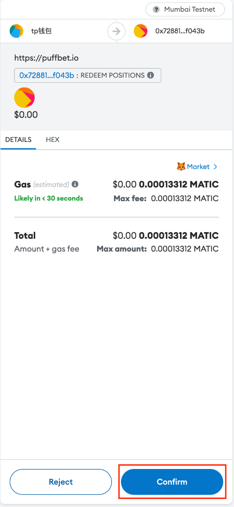

# How to redeem your right choice

As long as the question ends and the result is out, you are redeem the right result token in the Redeem module
1. Navigate to the question interaciton page, and scroll down to the Redeem module, click it.
2. The only thing you need to do is to press the Redeem Button and then confirm the transaction that pop uo in Metamask.

