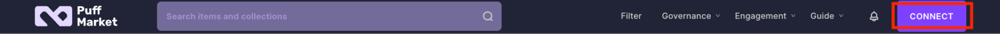
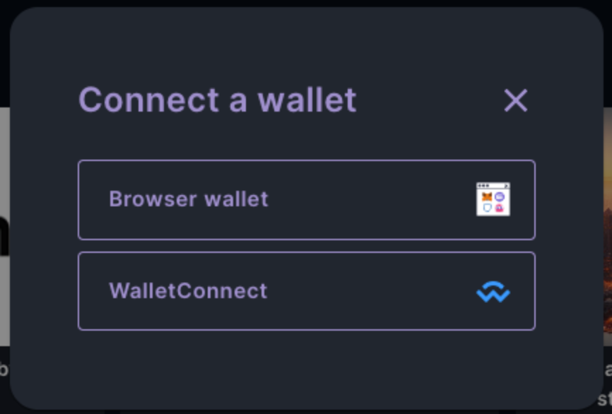
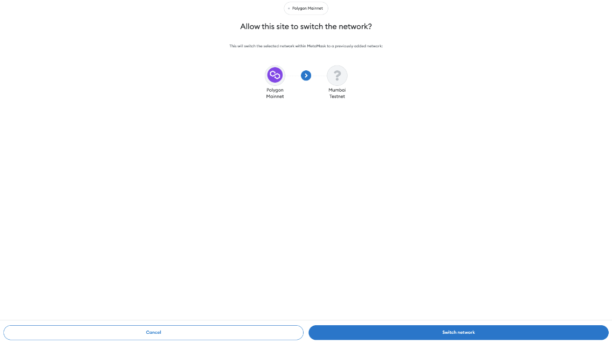
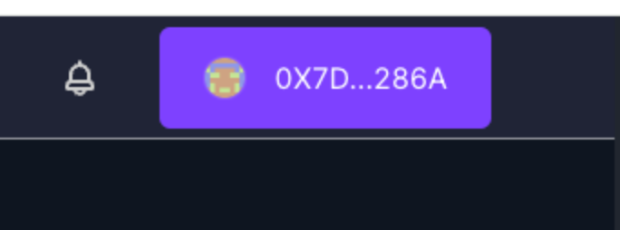

# How to sign in or (connect your wallet) 

1. In our app page, you can find CONNECT at the end of navigation bar. Click it.

2. Click Browser wallet if you are on a PC, otherwise WalletConnect.

3. After you choose your Metamask or other wallet application, Metamask will pop up and you will be asked to swith your current network to our default support network(Testnet for now), just click Switch network.

4. Once your wallet address showing in the navigation bar instead of CONNECT, you are successfully connected. Then you are ready to explore more.

