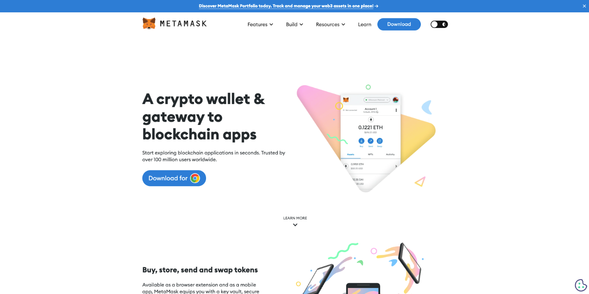
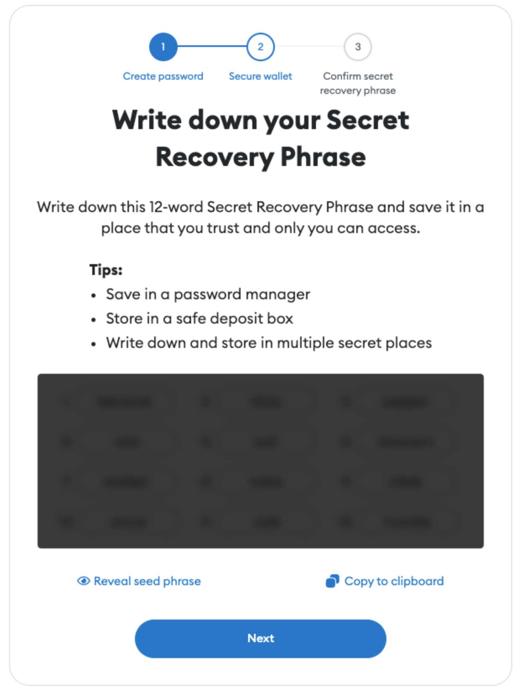
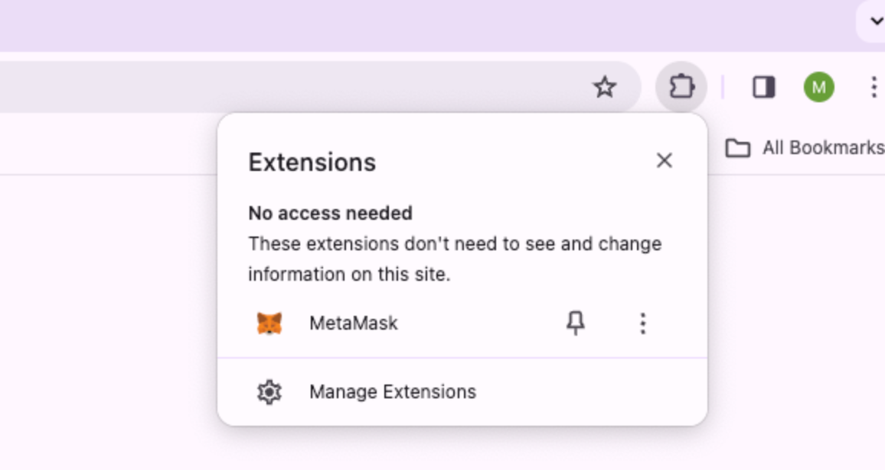

 
# How to create your wallet

There are many wallet management application options on the market, you can find your favourite. We will use Metamask to present you the basic knowledge of Wallet in Crypto.
1. Go to https://metamask.io/ and download for your browsers, Metamask supports Chrome, FireFox, Brave, Edge and Opera for now.

<!-- TODO改变图片的大小 
文章太长的话背景颜色不对 -->

<!--  -->

2. After you download Metamask, you can create your first on-chain wallet in Metamask, please make sure you save your Secret Recovery Phrase in a safe place, if it is explosured to other people, all your assets will be exploited. (Chrome as example)

 

3. You can find Metamsk in your extensions, or you can also pin it so that it will display in your Chrome dashboard. 

